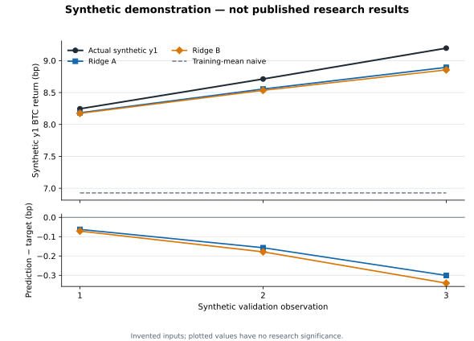

# Public Research Code

This directory contains a small, readable subset of the code used in the Polymarket BTC research project.

The full project includes continuous collectors, session-ledger generation, storage and archival tooling, recovery workflows, scheduled jobs, and other infrastructure that only makes sense as part of the system running the project.

I did not want the public repository to become a dump of all of that.

Instead, the code here focuses on the path most relevant to the research:

**how a Polymarket market session becomes causal model inputs, how those inputs are combined with BTC reference data, and how those rows are evaluated in the main paired Ridge comparison.**

## What is included

The public code covers a small but coherent path through the V1 research pipeline.

### `ledger_contract.py`

Defines the minimal in-memory session structure used by the public example.

It checks the basic shape of the ordered session data expected by the public feature code. It is not the full production ledger-certification system.

### `btc_timing.py`

Defines the lifecycle-based prediction timing used across the five Polymarket BTC horizons.

Rather than using the same number of seconds after market start for every horizon, V1 evaluates the market at the same point in its lifecycle: **40% of the way through the market**.

### `causal_features.py`

Builds the Polymarket features used by the study.

The important constraint is receipt-time causality: the feature builder can only use Polymarket messages that my collector had received by the prediction cutoff.

Later messages are ignored even if they exist in the completed session.

### `btc_reference.py`

Handles the Binance BTC side of the research.

It includes the exact one-second reference-bar logic, BTC control variables, future-return targets, and the column definitions used by the main model comparisons.

### `paired_ridge.py`

Contains the core mechanics of the paired Ridge comparison used in development.

That includes the chronological train/validation split, training-only standardization, paired eligibility, Ridge fitting, the naive comparator, and evaluation metrics.

It is intentionally smaller than the full internal research runners and does not include the complete gradient-boosting or final OOS execution machinery.

## Try the synthetic example

The repository includes a small example using completely made-up data:

Matplotlib is the only extra dependency for its plot. In an isolated local environment:

```bash
python3 -m venv .venv
. .venv/bin/activate
python3 -m pip install matplotlib
python3 -B examples/run_synthetic.py
```

The example walks through a simplified version of the public research path:

```text
synthetic market session
        ↓
lifecycle prediction cutoff
        ↓
causal Polymarket features
        ↓
Binance BTC controls + targets
        ↓
aligned model-ready row
        ↓
paired-evaluation eligibility
```

The point is to make the transformation logic easy to inspect without requiring the historical dataset used in the actual study.
The synthetic example does not reproduce the published model results.

Running the command regenerates the [synthetic predictions figure](../examples/output/synthetic_predictions.svg), which plots the invented validation targets and paired Ridge predictions. The lower panel makes the small difference between A and B visible.



## Why the published results are not fully reproducible from this repository

The final V1 results were produced from frozen historical artifacts that are much larger than the public code shown here.
Those include:

- historical Polymarket raw captures
- certified session ledgers
- Binance one-second BTC archives
- frozen feature tables
- exact development and held-back evaluation artifacts

Those datasets are not included in this repository.
The public code therefore makes the method and transformation logic inspectable, but it is not a complete packaged copy of the historical research environment.
Reproducing the exact published development and OOS metrics would require the frozen historical artifacts used by the study.

## What is intentionally left out

The public repository does not include the complete production system.
That includes things such as:

- continuous collectors
- systemd services and timers
- full ledger certification and materialization
- machine-specific configuration
- storage migration tooling
- archive and reclamation jobs
- recovery scripts and historical repair workflows
- private filesystem paths
- large raw data archives
- the full internal OOS execution system
- internal source-of-truth and operations documentation

Those parts were important to building and operating the project, but they are not necessary to understand the V1 research method.
For the engineering story behind them, see the [project journey](../DOCUMENTATION/project_journey.md) and [architecture guide](../DOCUMENTATION/architecture.md).

## What this code is for

This is not intended to be a reusable trading framework or a deployable Polymarket production system.
It is a focused public view of the code needed to understand the research process.
If you want to understand the experiment itself, start with:

- [Data and feature methodology](../DOCUMENTATION/data_and_feature_methodology.md)
- [Evaluation methodology](../DOCUMENTATION/evaluation_methodology.md)
- [Results](../RESULTS/summary.md)

For the broader story of how the project was built:

- [Project journey](../DOCUMENTATION/project_journey.md)
- [Working with AI](../DOCUMENTATION/working_with_ai.md)
