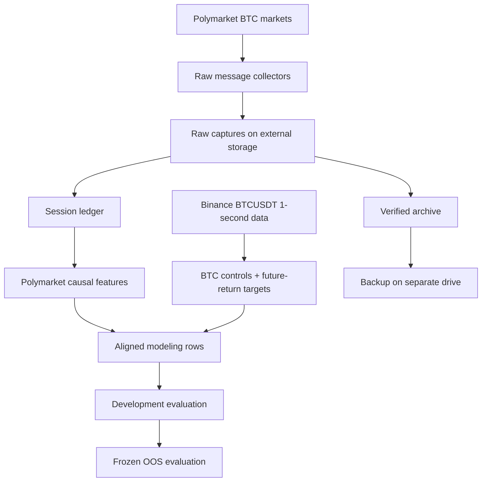

# Architecture

The current system is built around one idea: keep the original market data, make the transformations traceable, and separate collection from research.

The project runs continuously on a dedicated Linux machine and collects Polymarket BTC markets across **5-minute, 15-minute, 1-hour, 4-hour, and 1-day** horizons.

## System overview

There are really three different parts of the system:

1. collection and storage
2. turning raw data into research-ready data
3. evaluation

Keeping those responsibilities separate became important as the project grew.

## Collection and raw data

Separate collectors continuously capture Polymarket BTC market messages for each supported horizon.

The raw captures are treated as the original source data. They are stored on external storage rather than being discarded after a cleaner dataset is created.

That matters because if I later find a bug in the ledger or feature code, I can rebuild the derived data instead of being stuck with whatever an older version of the code produced.

The collection system also records receipt timing. For this project, it is not enough to know when an event claims to have happened. I also need to know whether my machine had actually received the information by the prediction cutoff.

## Session ledger

Raw message streams are useful as evidence, but they are awkward to work with directly.

The session ledger turns the raw messages for each market into an ordered, checkable session record.

It preserves information such as:

- message order
- receipt timing
- source identity
- session completeness
- references back to the source data

The ledger is a derived representation, not a replacement for the raw capture.

This gives the research pipeline a consistent input while still allowing a result to be traced back toward the original messages.

## Polymarket and BTC features

The research layer combines two separate sources of information.

The Polymarket side builds features from the market state at the prediction cutoff. The feature code only uses messages that had actually been received by that point.

The Bitcoin side uses Binance BTCUSDT one-second bars to build the BTC control variables and future-return targets used by the models.

For the V1 study, the prediction cutoff is defined at 40% of the way through each Polymarket market's lifetime. This keeps the lifecycle position consistent across the 5-minute, 15-minute, 1-hour, 4-hour, and 1-day markets.

The two sides are then combined into aligned rows for modeling.

## Evaluation

The modeling pipeline separates development from the final held-back evaluation.

During development, I used chronological training and validation data to compare different feature sets and models.

Before running the final out-of-sample evaluation, I froze:

- the feature definitions
- prediction timing
- model comparisons
- development and held-back dates
- evaluation rules

The final held-back block was then evaluated once without changing the experiment based on the result.

The public code in [`CODE/`](../CODE/README.md) contains a smaller version of this research path using synthetic data.

## Storage and archival

Continuous raw collection eventually became large enough that storage had to become part of the architecture.

Older raw captures can be archived, but I do not want the system deleting source data just because a derived dataset exists.

Before older raw data can be removed, the storage process verifies that the archive exists and that a separate backup copy exists on another drive.

This lets the active storage remain manageable while still preserving the original source material needed for recovery or rebuilding.

## What is not shown here

The production system contains additional operational pieces for scheduling, validation, recovery, and storage maintenance.

Those details are intentionally left out of the public architecture because they are specific to the machine running the project and are not necessary to understand the research.

For how the system evolved into this architecture, see the [project journey](project_journey.md).

For the research details, see:

- [Data and feature methodology](data_and_feature_methodology.md)
- [Evaluation methodology](evaluation_methodology.md)
- [Results](../RESULTS/summary.md)
