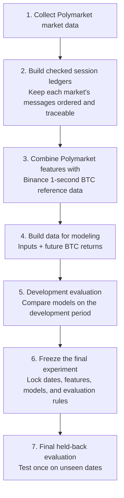
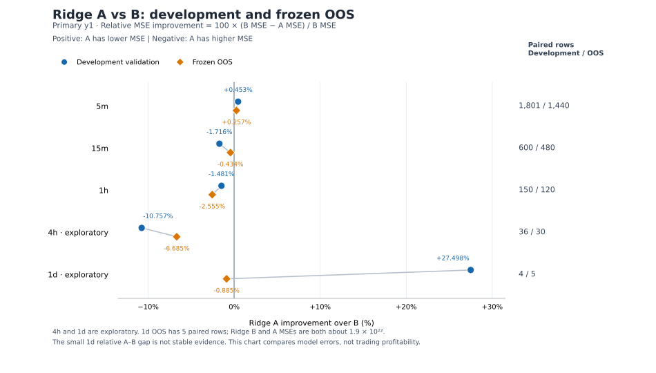

# Polymarket BTC Research

I built a market-data pipeline to collect Polymarket BTC markets and test a simple question:

**Does Polymarket tell us anything about Bitcoin's next move that isn't already visible in the BTC market itself?**

What started as a small data-collection experiment turned into a much bigger engineering and research project. I ended up building continuous collectors, a way to turn raw messages into checkable session records, external storage and archival, causal feature generation, and a frozen evaluation process designed to keep me from changing the experiment after seeing the final results.

## What I built

- Continuous collectors for BTC prediction markets with **5-minute, 15-minute, 1-hour, 4-hour, and 1-day** horizons.
- Raw message capture plus a session ledger. This is basically a record that keeps each market's messages in order and lets me trace later modeling rows back to the original data.
- Code that combines Polymarket state with exact **one-second Binance BTC bars**.
- A dedicated Linux host with external storage, scheduled jobs, verified archives, and a checked backup on a separate drive before older raw data can be removed.
- A research pipeline where Polymarket features only use messages my machine had received by the prediction cutoff.
- A frozen final evaluation using dates I set aside ahead of time and only use once at the end.

The project grew well past the scale of the original prototype. For example, one five-horizon pipeline validation day contained **415 market sessions and 19.5 million ledger rows**. That number describes a pipeline validation workload, not the size of the modeling datasets.

### Workflow



The [architecture guide](DOCUMENTATION/architecture.md) explains how the current system fits together and why I separated raw data, processed data, modeling data, and storage maintenance.

## The research question

Across the different Polymarket BTC market lengths, I wanted to test whether the market's price or recent movement contained useful information about future BTC returns after accounting for information already available in the BTC market.

The 5-minute markets are the primary V1 study, because they gave me the largest and most useful sample for the main comparison. I also tested longer horizons, with the 15-minute and 1-hour markets used as secondary evidence and the 4-hour and 1-day markets treated more exploratorily because there are far fewer observations.

For the primary 5-minute study, I take the Polymarket state at 40% of the market's lifetime and test whether its price level or recent price change helps predict roughly the next minute of BTC returns after accounting for BTC market data and basic Polymarket quote-quality information.

The important part is how the comparison is constructed.

The Polymarket code only sees messages my machine had received by the prediction cutoff. Future BTC returns are used only as targets, never as model inputs. I also fixed the dates, features, comparisons, and final evaluation procedure before looking at the held-back results.

## Where V1 stands

The BTC 5-minute development dataset contains 7,548 selected sessions.

- 7,517 have complete Polymarket and BTC inputs.
- 31 have incomplete Polymarket information and are left incomplete rather than filled with guessed values.
- The main comparison uses 5,716 training sessions and 1,801 validation sessions where both models can be evaluated on exactly the same data.

During development, Ridge A, which adds Polymarket price level `q` and recent price movement `dq10`, improved slightly over Ridge B, which uses BTC data plus Polymarket quote-quality information.

But both models still performed worse than a simple baseline based on the training average.

So the development result was interesting, but it did not by itself show a useful trading edge.

The final one-shot out-of-sample evaluation scored all 2,075 selected sessions across the five market horizons:

- 5m: 1,440 paired OOS rows
- 15m: 480
- 1h: 120
- 4h: 30
- 1d: 5

At the primary 5-minute horizon, Ridge A's y1 MSE was 0.257% lower than Ridge B's, reproducing the same small A-over-B direction seen during development.

Ridge A did not beat Ridge B at the 15-minute, 1-hour, 4-hour, or 1-day horizons.

The 1-day result also contains an extreme July 16 error. I kept it exactly as the frozen experiment scored it rather than removing it after seeing the result.

### V1 conclusion

The 5-minute result suggests that the added Polymarket features may contain a small amount of incremental predictive information beyond the BTC and market-quality controls used here.

But the effect is small, the slower horizons did not reproduce it, and this study does not establish a profitable trading edge or live execution performance.



Ridge A's small positive y1 MSE improvement over B at 5m persisted in frozen OOS; the other four horizons had no positive OOS A-versus-B result. Paired samples fall sharply at longer horizons, so the 4h and especially 1d comparisons are exploratory. The chart compares relative model errors, not trading profitability.

The full development and final results are in [summary.md](RESULTS/summary.md).

## What I learned building it

A lot of this project came from learning what actually breaks when a data-collection experiment runs continuously.

I keep the raw captures as the original source of the data instead of treating the processed ledgers or modeling data as replacements for them. When I build data for modeling, I also keep enough information to trace rows back through the ledger to the data they came from. That became important once I started rebuilding datasets, debugging weird results, and trying to make experiments reproducible.

Storage also became a real engineering problem. The raw captures got large enough that I had to move them onto external storage and build a process for archiving older data. Raw data is only removed after the system verifies that an archive and a backup on a separate drive exist.

The project has also had a lot of ups and downs. I have dealt with collection failures, full disks, migrations, broken scheduled jobs, recovery work, and some pretty serious bugs. Fixing those problems taught me a lot about unattended software, data integrity, reproducibility, and how to recover a system without making the situation worse.

The [project journey](DOCUMENTATION/project_journey.md) goes through how the project evolved from the original VPS/Mac setup into the current Linux system, including the mistakes that ended up changing how I built the rest of it.

## What the results can and cannot say

This is an archival research study, not a live trading system.

The Binance archive gives exact one-second exchange bars, but it does not tell me exactly when each completed bar would have reached my machine in real time. The evaluation also does not model realistic fills, fees, queue position, or network latency.

That means a small predictive difference in these results should not automatically be interpreted as something that could have been traded profitably.

I also summarize an older sidecar-based Polymarket experiment as historical research. It used different data and rules and should not be confused with the current ledger-based V1 study.

For more detail, see:

- [Evaluation methodology](DOCUMENTATION/evaluation_methodology.md)
- [Full results](RESULTS/summary.md)
- [Limitations and next steps](DOCUMENTATION/limitations_and_next_steps.md)

## Try the public code

The repository includes a small synthetic example showing how the public research code handles a market session without requiring the private historical dataset.

The example requires Python 3.10+ and Matplotlib. See the [setup instructions](CODE/README.md#try-the-synthetic-example).

```bash
python3 -B examples/run_synthetic.py
```

The example uses made-up data and does not reproduce the published model results. Reproducing those results requires the certified historical Polymarket ledgers, Binance reference data, and frozen research artifacts used in the study.

See the [public code guide](CODE/README.md) for what is included in the public code and what is intentionally left out.

## How I used AI

I used ChatGPT and Codex throughout the project for research, debugging, code review, documentation, and implementation. A big part of the project was learning how to use them well: giving them bounded tasks, being efficient with session context and token usage, maintaining source-of-truth and handoff documentation, checking their assumptions, and keeping important decisions and final validation in my own hands.

I wrote more about that process in [Working with AI](DOCUMENTATION/working_with_ai.md).

## Explore the project

- [Architecture](DOCUMENTATION/architecture.md)
- [Project journey](DOCUMENTATION/project_journey.md)
- [Data and feature methodology](DOCUMENTATION/data_and_feature_methodology.md)
- [Evaluation methodology](DOCUMENTATION/evaluation_methodology.md)
- [Results](RESULTS/summary.md)
- [Limitations and next steps](DOCUMENTATION/limitations_and_next_steps.md)
- [Working with AI](DOCUMENTATION/working_with_ai.md)
